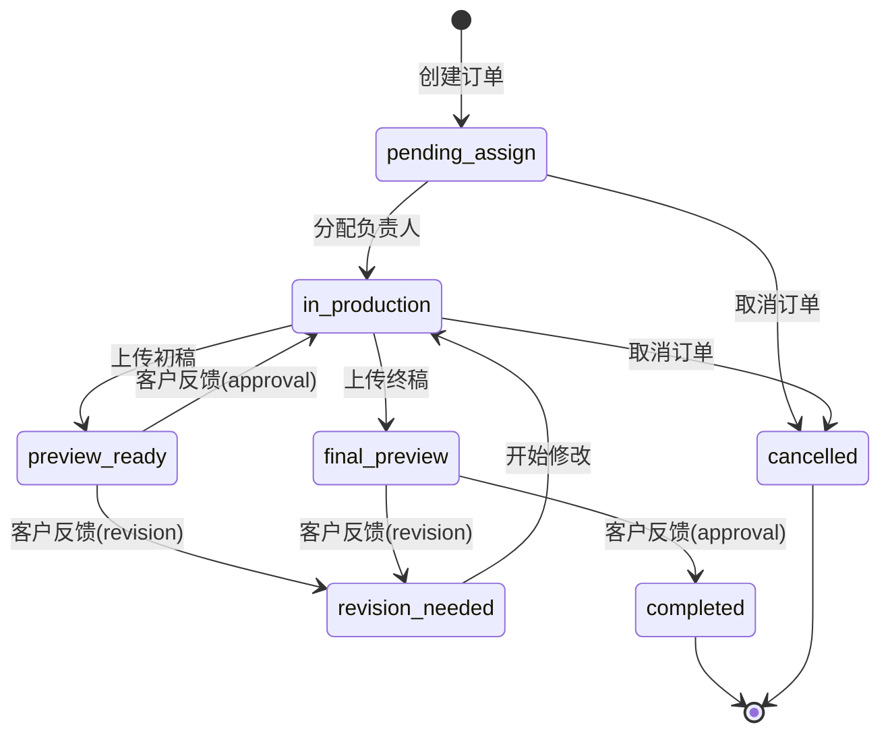

# 订单状态机详细说明

## 状态定义

| 状态代码 | 状态名称 | 说明 | 可进入角色 |
|---------|---------|------|-----------|
| `pending_assign` | 待分配 | 订单已创建，等待管理员分配负责人 | 系统自动 |
| `in_production` | 制作中 | 负责人正在制作内容 | 管理员、负责人 |
| `preview_ready` | 初稿预览 | 初稿已上传，等待客户反馈 | 管理员、负责人 |
| `revision_needed` | 需要修改 | 客户提出修改意见，需要返工 | 系统自动（客户反馈触发） |
| `final_preview` | 终稿预览 | 终稿已完成，等待客户最终确认 | 管理员、负责人 |
| `completed` | 已完成 | 订单完成 | 系统自动（客户确认触发） |
| `cancelled` | 已取消 | 订单被取消 | 管理员 |

## 状态流转图



## 详细流程说明

### 流程 1: 正常流程（无修改）

```
用户创建订单
    ↓
[pending_assign] 待分配
    ↓ (管理员分配负责人)
[in_production] 制作中
    ↓ (负责人上传初稿)
[preview_ready] 初稿预览
    ↓ (客户确认通过: type=approval)
[in_production] 制作终稿
    ↓ (负责人上传终稿)
[final_preview] 终稿预览
    ↓ (客户最终确认: type=approval)
[completed] 已完成
```

**示例时间线：**
- Day 1: 用户创建订单，管理员分配给张设计
- Day 2-5: 张设计制作初稿
- Day 6: 张设计上传初稿，客户确认通过
- Day 7-8: 张设计制作终稿
- Day 9: 张设计上传终稿，客户最终确认
- 订单完成

### 流程 2: 有修改流程

```
[preview_ready] 初稿预览
    ↓ (客户提出修改: type=revision)
[revision_needed] 需要修改 (revisionCount++)
    ↓ (负责人更新状态)
[in_production] 重新制作
    ↓ (负责人上传修改后的稿件)
[preview_ready] 预览 (第N次修改)
    ↓ (客户确认: type=approval)
[in_production] 制作终稿
    ↓ (负责人上传终稿)
[final_preview] 终稿预览
    ↓ (客户最终确认: type=approval)
[completed] 已完成
```

**示例时间线（带2次修改）：**
- Day 1: 订单创建并分配
- Day 2-5: 制作初稿
- Day 6: 上传初稿，客户反馈需修改（第1次）
- Day 7-8: 修改制作
- Day 9: 上传修改稿，客户反馈仍需修改（第2次）
- Day 10-11: 再次修改
- Day 12: 上传修改稿，客户确认通过
- Day 13-14: 制作终稿
- Day 15: 上传终稿，客户最终确认
- 订单完成

## 状态转换规则

### 1. pending_assign → in_production
**触发条件：** 管理员分配负责人
**API 调用：** `PUT /orders/{orderId}/assign`
**必需参数：**
```json
{
  "assigneeId": "staff-001",
  "assigneeName": "张设计"
}
```
**后续状态更新：** `PUT /orders/{orderId}/status` with `{"status": "in_production"}`

### 2. in_production → preview_ready
**触发条件：** 负责人上传预览文件
**API 调用：**
1. 先上传预览文件：`POST /orders/{orderId}/preview`
```json
{
  "files": [
    {
      "id": "preview-001",
      "name": "preview_v1.mp4",
      "size": 10240000,
      "type": "video/mp4",
      "uploadTime": "2025-11-05T15:00:00Z"
    }
  ]
}
```
2. 更新状态：`PUT /orders/{orderId}/status` with `{"status": "preview_ready"}`

### 3. preview_ready → revision_needed
**触发条件：** 客户提交修改反馈
**API 调用：** `POST /orders/{orderId}/feedback`
```json
{
  "type": "revision",
  "content": "背景需要调整为蓝色，飞船细节需要更精致"
}
```
**系统自动：**
- 状态变更为 `revision_needed`
- `revisionCount` 加 1
- 通知负责人

### 4. preview_ready → in_production
**触发条件：** 客户确认初稿通过
**API 调用：** `POST /orders/{orderId}/feedback`
```json
{
  "type": "approval",
  "content": "初稿效果很好，请继续制作终稿"
}
```
**系统自动：**
- 状态变更为 `in_production`
- 通知负责人继续制作终稿

### 5. revision_needed → in_production
**触发条件：** 负责人开始修改
**API 调用：** `PUT /orders/{orderId}/status` with `{"status": "in_production"}`

### 6. in_production → final_preview
**触发条件：** 负责人上传终稿
**API 调用：**
1. 上传终稿：`POST /orders/{orderId}/preview`
2. 更新状态：`PUT /orders/{orderId}/status` with `{"status": "final_preview"}`

### 7. final_preview → completed
**触发条件：** 客户最终确认
**API 调用：** `POST /orders/{orderId}/feedback`
```json
{
  "type": "approval",
  "content": "终稿完美，确认验收"
}
```
**系统自动：**
- 状态变更为 `completed`
- 通知所有相关人员

### 8. final_preview → revision_needed
**触发条件：** 客户对终稿仍有修改意见
**API 调用：** `POST /orders/{orderId}/feedback`
```json
{
  "type": "revision",
  "content": "终稿整体不错，但音效需要调整"
}
```
**系统自动：**
- 状态变更为 `revision_needed`
- `revisionCount` 加 1

### 9. 任意状态 → cancelled
**触发条件：** 管理员取消订单
**API 调用：** `PUT /orders/{orderId}/status` with `{"status": "cancelled"}`
**限制：** 只有管理员可操作，已完成订单不可取消

## 权限矩阵

| 状态转换 | 普通用户 | 负责人 | 管理员 |
|---------|---------|--------|--------|
| pending_assign → in_production | ❌ | ❌ | ✅ |
| in_production → preview_ready | ❌ | ✅ | ✅ |
| preview_ready → revision_needed | ✅ (通过反馈) | ❌ | ❌ |
| preview_ready → in_production | ✅ (通过反馈) | ❌ | ❌ |
| revision_needed → in_production | ❌ | ✅ | ✅ |
| in_production → final_preview | ❌ | ✅ | ✅ |
| final_preview → completed | ✅ (通过反馈) | ❌ | ✅ |
| final_preview → revision_needed | ✅ (通过反馈) | ❌ | ❌ |
| * → cancelled | ❌ | ❌ | ✅ |

## 业务规则

### 1. 修改次数限制
```javascript
// 建议实现修改次数限制
const MAX_REVISION_COUNT = 3;

if (order.revisionCount >= MAX_REVISION_COUNT) {
  // 需要管理员审批或额外收费
  throw new Error('已达到最大修改次数，请联系客服');
}
```

### 2. 状态超时提醒
```javascript
// 建议实现超时提醒机制
const STATE_TIMEOUT_HOURS = {
  pending_assign: 24,    // 24小时内必须分配
  in_production: 168,    // 7天内应该有进展
  preview_ready: 72,     // 3天内客户应该反馈
  final_preview: 48      // 2天内客户应该确认
};
```

### 3. 预览文件版本管理
```javascript
// 每次上传预览文件时，应该记录版本
interface PreviewVersion {
  version: number;        // 版本号
  files: UploadedFile[];
  uploadedAt: string;
  uploadedBy: string;
  feedbacks: OrderFeedback[];  // 该版本收到的反馈
}
```

### 4. 状态变更日志
```javascript
// 建议记录所有状态变更历史
interface StatusChangeLog {
  id: string;
  orderId: string;
  fromStatus: OrderStatus;
  toStatus: OrderStatus;
  changedBy: string;
  changedAt: string;
  reason?: string;  // 变更原因
}
```

## 通知规则

### 状态变更时的通知

| 状态 | 通知对象 | 通知内容 |
|------|---------|---------|
| pending_assign | 管理员 | 新订单待分配 |
| in_production | 客户、负责人 | 订单已开始制作 |
| preview_ready | 客户 | 预览文件已上传，请查看反馈 |
| revision_needed | 负责人 | 客户提出修改意见 |
| final_preview | 客户 | 终稿已完成，请确认 |
| completed | 客户、负责人、管理员 | 订单已完成 |
| cancelled | 客户、负责人 | 订单已取消 |

## API 示例代码

### 完整的订单流程示例

```javascript
// 1. 用户创建订单
const createOrderResponse = await fetch('/api/orders', {
  method: 'POST',
  headers: {
    'Authorization': `Bearer ${userToken}`,
    'Content-Type': 'application/json'
  },
  body: JSON.stringify({
    orderType: 'ai_3d_custom',
    configuration: '4K显示屏',
    creativeIdea: '太空主题',
    scenePhotos: [...]
  })
});
const order = await createOrderResponse.json();
// 订单状态: pending_assign

// 2. 管理员分配负责人
await fetch(`/api/orders/${order.data.id}/assign`, {
  method: 'PUT',
  headers: {
    'Authorization': `Bearer ${adminToken}`,
    'Content-Type': 'application/json'
  },
  body: JSON.stringify({
    assigneeId: 'staff-001',
    assigneeName: '张设计'
  })
});
// 订单状态: in_production

// 3. 负责人上传初稿
await fetch(`/api/orders/${order.data.id}/preview`, {
  method: 'POST',
  headers: {
    'Authorization': `Bearer ${staffToken}`,
    'Content-Type': 'application/json'
  },
  body: JSON.stringify({
    files: [{
      id: 'preview-001',
      name: 'preview_v1.mp4',
      size: 10240000,
      type: 'video/mp4',
      uploadTime: new Date().toISOString()
    }]
  })
});

await fetch(`/api/orders/${order.data.id}/status`, {
  method: 'PUT',
  headers: {
    'Authorization': `Bearer ${staffToken}`,
    'Content-Type': 'application/json'
  },
  body: JSON.stringify({ status: 'preview_ready' })
});
// 订单状态: preview_ready

// 4. 客户确认初稿
await fetch(`/api/orders/${order.data.id}/feedback`, {
  method: 'POST',
  headers: {
    'Authorization': `Bearer ${userToken}`,
    'Content-Type': 'application/json'
  },
  body: JSON.stringify({
    type: 'approval',
    content: '初稿很好，请继续'
  })
});
// 订单状态: in_production (制作终稿)

// 5. 负责人上传终稿并更新状态
await fetch(`/api/orders/${order.data.id}/preview`, {
  method: 'POST',
  headers: {
    'Authorization': `Bearer ${staffToken}`,
    'Content-Type': 'application/json'
  },
  body: JSON.stringify({
    files: [{
      id: 'preview-002',
      name: 'final_v1.mp4',
      size: 15360000,
      type: 'video/mp4',
      uploadTime: new Date().toISOString()
    }]
  })
});

await fetch(`/api/orders/${order.data.id}/status`, {
  method: 'PUT',
  headers: {
    'Authorization': `Bearer ${staffToken}`,
    'Content-Type': 'application/json'
  },
  body: JSON.stringify({ status: 'final_preview' })
});
// 订单状态: final_preview

// 6. 客户最终确认
await fetch(`/api/orders/${order.data.id}/feedback`, {
  method: 'POST',
  headers: {
    'Authorization': `Bearer ${userToken}`,
    'Content-Type': 'application/json'
  },
  body: JSON.stringify({
    type: 'approval',
    content: '完美，验收通过'
  })
});
// 订单状态: completed
```

## 错误处理

### 非法状态转换
```json
{
  "code": 400,
  "message": "非法的状态转换: preview_ready -> completed",
  "data": {
    "currentStatus": "preview_ready",
    "attemptedStatus": "completed",
    "allowedTransitions": ["revision_needed", "in_production"]
  }
}
```

### 权限不足
```json
{
  "code": 403,
  "message": "您没有权限执行此操作",
  "data": {
    "requiredRole": "admin",
    "currentRole": "user"
  }
}
```

