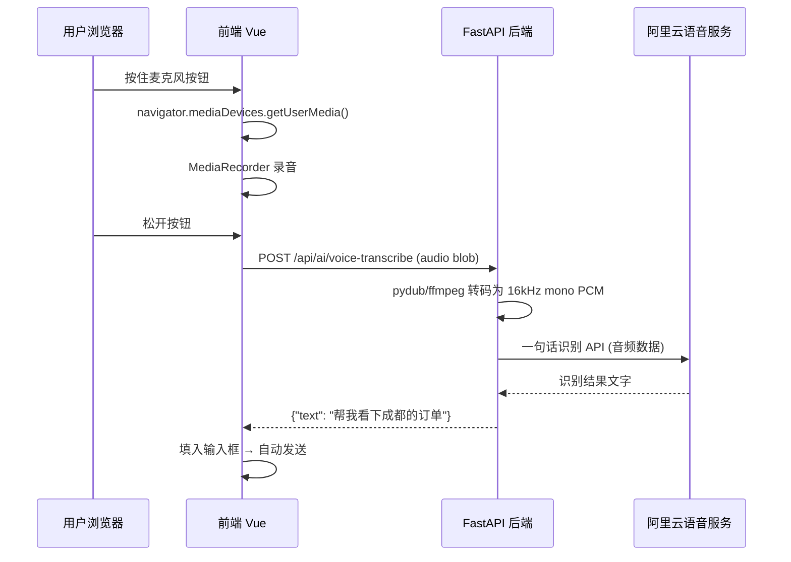
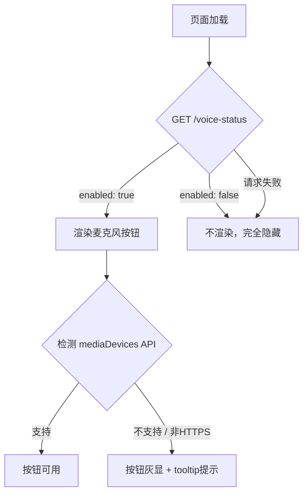

# 语音输入功能实施计划（阿里云 + 可配置开关）

> 基于阿里云「智能语音交互 - 一句话识别」，为 AI Agent 聊天输入框添加「按住说话」语音输入能力。

---

## 一、整体架构



---

## 二、涉及改动的文件清单

| 层级 | 文件 | 改动内容 |
|:---|:---|:---|
| **配置** | [config.py](file:///Users/menghongtao/Documents/anti_pro/cursor_sh/backend/app/config.py) | 新增 `VOICE_ENABLED`、`VOICE_ACCESS_KEY_ID`、`VOICE_ACCESS_KEY_SECRET`、`VOICE_APP_KEY` 等配置项 |
| **配置** | [.env](file:///Users/menghongtao/Documents/anti_pro/cursor_sh/backend/.env) | 新增语音配置块 |
| **后端路由** | `backend/app/api/ai_voice.py` | **新建**，语音转文字 API 端点 |
| **后端注册** | [main.py](file:///Users/menghongtao/Documents/anti_pro/cursor_sh/backend/app/main.py) | 注册 `voice_router` |
| **后端依赖** | `backend/requirements.txt` | 新增 `pydub`、`alibabacloud-nls20190201` 或 `aliyun-python-sdk-core` |
| **前端组件** | [AIChatAssistant.vue](file:///Users/menghongtao/Documents/anti_pro/cursor_sh/src/components/AIChatAssistant.vue) | 输入框旁新增麦克风按钮 + 录音逻辑 |
| **前端 API** | [api.ts](file:///Users/menghongtao/Documents/anti_pro/cursor_sh/src/utils/api.ts) | 新增 `voiceApi.transcribe()` |
| **前端 API** | [api.ts](file:///Users/menghongtao/Documents/anti_pro/cursor_sh/src/utils/api.ts) | 新增 `voiceApi.getStatus()` 获取后端开关状态 |

---

## 三、分步实施详情

### Step 1：后端配置项（功能开关）

在 `config.py` 的 `Settings` 类中新增：

```python
# ========== 阿里云语音识别（一句话识别）==========
VOICE_ENABLED: bool = False                # 总开关：是否启用语音输入
VOICE_ACCESS_KEY_ID: str = ""              # 可与短信/OSS 共用同一 AK
VOICE_ACCESS_KEY_SECRET: str = ""
VOICE_APP_KEY: str = ""                    # 智能语音交互项目的 Appkey
VOICE_REGION: str = "cn-shanghai"          # 服务区域
VOICE_MAX_DURATION: int = 60              # 最长录音秒数（防滥用）
VOICE_MAX_FILE_SIZE: int = 10485760       # 最大音频文件 10MB
```

在 `.env` 中新增配置块：

```env
# ========== 阿里云语音识别（一句话识别）==========
VOICE_ENABLED=False
VOICE_ACCESS_KEY_ID=
VOICE_ACCESS_KEY_SECRET=
VOICE_APP_KEY=
VOICE_REGION=cn-shanghai
VOICE_MAX_DURATION=60
VOICE_MAX_FILE_SIZE=10485760
```

> [!IMPORTANT]
> 当 `VOICE_ENABLED=False` 时：
> - 后端 `/voice-transcribe` 接口直接返回 403
> - 前端通过 `/voice-status` 接口获取到 `enabled: false`，**不渲染**麦克风按钮
> 
> 完全零副作用，不影响任何现有功能。

---

### Step 2：后端 API 端点

新建文件 `backend/app/api/ai_voice.py`：

**两个端点：**

| 端点 | 方法 | 用途 |
|:---|:---|:---|
| `GET /api/ai/voice-status` | GET | 前端启动时查询语音功能是否启用 |
| `POST /api/ai/voice-transcribe` | POST | 接收音频文件，返回识别文字 |

**核心逻辑：**

```python
@voice_router.get("/voice-status")
async def voice_status():
    """前端通过此接口决定是否显示麦克风按钮"""
    return {"enabled": settings.VOICE_ENABLED}


@voice_router.post("/voice-transcribe")
async def voice_transcribe(
    audio_file: UploadFile = File(...),
    raw_request: Request
):
    """接收前端录音文件，转码后发送至阿里云一句话识别，返回文字"""
    if not settings.VOICE_ENABLED:
        raise HTTPException(403, "语音输入功能未启用")

    # 1. 校验文件大小
    audio_bytes = await audio_file.read()
    if len(audio_bytes) > settings.VOICE_MAX_FILE_SIZE:
        raise HTTPException(400, "音频文件过大")

    # 2. 用 pydub(ffmpeg) 转码为阿里云要求的格式
    #    16kHz、单声道、16bit PCM
    audio_seg = AudioSegment.from_file(io.BytesIO(audio_bytes))
    audio_seg = audio_seg.set_frame_rate(16000).set_channels(1).set_sample_width(2)
    pcm_buffer = io.BytesIO()
    audio_seg.export(pcm_buffer, format="wav")
    wav_bytes = pcm_buffer.getvalue()

    # 3. 调用阿里云一句话识别 RESTful API
    recognized_text = await _ali_recognize(wav_bytes)

    return {"success": True, "text": recognized_text}
```

---

### Step 3：阿里云 SDK 调用细节

阿里云一句话识别支持两种调用方式，推荐使用 **RESTful POST 方式**（简单、无需 WebSocket）：

```
POST https://nls-gateway-cn-shanghai.aliyuncs.com/stream/v1/asr

Headers:
  X-NLS-Token: <通过 CreateToken 获取的临时 Token>
  Content-Type: application/octet-stream

Query Params:
  appkey=<你的 Appkey>
  format=wav
  sample_rate=16000
  enable_punctuation_prediction=true    // 自动补标点
  enable_inverse_text_normalization=true // 自动转阿拉伯数字

Body: 原始音频二进制流
```

> [!WARNING]
> **Token 机制**：阿里云一句话识别不像短信 API 那样直接用 AK/SK 签名。它需要先调一个 `CreateToken` 接口获取一个临时 Token（有效期 24h），然后用这个 Token 去调识别接口。
> 
> 建议在后端做一个 **Token 缓存**，过期前 10 分钟自动刷新，避免每次识别都多一次请求。

**Token 获取代码：**

```python
from aliyunsdkcore.client import AcsClient
from aliyunsdkcore.request import CommonRequest
import json, time

_token_cache = {"token": "", "expire_time": 0}

async def _get_ali_token() -> str:
    """获取阿里云语音服务临时 Token（带缓存）"""
    if _token_cache["token"] and time.time() < _token_cache["expire_time"] - 600:
        return _token_cache["token"]

    client = AcsClient(
        settings.VOICE_ACCESS_KEY_ID,
        settings.VOICE_ACCESS_KEY_SECRET,
        settings.VOICE_REGION
    )
    request = CommonRequest()
    request.set_method('POST')
    request.set_domain('nls-meta.cn-shanghai.aliyuncs.com')
    request.set_version('2019-02-28')
    request.set_action_name('CreateToken')

    response = client.do_action_with_exception(request)
    result = json.loads(response)
    token = result["Token"]["Id"]
    expire_time = result["Token"]["ExpireTime"]

    _token_cache["token"] = token
    _token_cache["expire_time"] = expire_time
    return token
```

---

### Step 4：前端实现

#### 4a. 获取开关状态 & 条件渲染

```typescript
// api.ts
export const voiceApi = {
  async getStatus(): Promise<{ enabled: boolean }> {
    return request.get('/ai/voice-status')
  },
  async transcribe(audioBlob: Blob): Promise<{ text: string }> {
    const formData = new FormData()
    formData.append('audio_file', audioBlob, 'recording.webm')
    return request.post('/ai/voice-transcribe', formData, {
      headers: { 'Content-Type': 'multipart/form-data' }
    })
  }
}
```

#### 4b. 麦克风按钮 UI（在输入框的 `right-tools` 中，Send 按钮左边）

当前输入区结构：
```
[＋ 图片] [__________文字输入框__________] [Send ↑]
```

改成：
```
[＋ 图片] [__________文字输入框__________] [🎙] [Send ↑]
```

按住 `🎙` 时：
- 输入框区域变为录音提示状态（波形动画 + "松开发送，上滑取消"文字）
- `MediaRecorder` 开始采集

松开时：
- 将 `audioChunks` 拼装成 `Blob`
- 调用 `voiceApi.transcribe(blob)`
- 将返回的 `text` 填入 `inputMsg`
- 自动触发 `sendMessage()`

#### 4c. 录音状态 UI 效果

| 状态 | UI 表现 |
|:---|:---|
| 未录音 | 显示灰色/白色麦克风图标 |
| 录音中 | 图标变为**红色脉冲动画**，输入框内显示 "正在聆听..." + 波形动画 |
| 识别中 | 输入框内显示 "识别中..." + Loading spinner |
| 上滑取消 | 图标变为 ❌，提示 "松开取消" |

---

## 四、额外需要考虑的要点

### 4.1 浏览器兼容性 & HTTPS 要求

> [!CAUTION]
> `navigator.mediaDevices.getUserMedia()` 要求页面必须是 **HTTPS** 或 `localhost`。如果你的测试/生产环境不是 HTTPS，麦克风权限会被浏览器直接拒绝。
> 
> 如果前端检测到麦不可用 (`navigator.mediaDevices` 为 undefined)，应自动隐藏麦克风按钮而不是报错。

### 4.2 音频格式转码（ffmpeg 依赖）

后端服务器上必须安装 `ffmpeg`：

```bash
# macOS
brew install ffmpeg

# Ubuntu/Debian (服务器)
apt-get install ffmpeg

# Python 依赖
pip install pydub
```

`pydub` 本身只是一个 Python wrapper，实际干活的是系统 `ffmpeg` 二进制。如果服务器上没装 `ffmpeg`，`AudioSegment.from_file()` 会直接报错。

### 4.3 安全防护

| 风险点 | 对策 |
|:---|:---|
| 恶意上传超大文件 | `VOICE_MAX_FILE_SIZE` 限制（默认 10MB） |
| 高频调用刷接口 | 复用现有的 `RATE_LIMIT` 限流机制 |
| AK/SK 泄露 | 前端不接触 AK/SK，全部由后端代理 |
| 未登录用户调用 | 要求 Bearer Token 鉴权（复用现有 `get_current_user`） |

### 4.4 阿里云服务开通步骤

1. 登录 [阿里云控制台](https://nls-portal.console.aliyun.com/)
2. 搜索 **智能语音交互**，点击开通
3. 进入「项目管理」→「创建项目」
4. 勾选「一句话识别」能力
5. 获取项目的 **Appkey**
6. AK/SK 可复用现有短信服务的 `SMS_ACCESS_KEY_ID` / `SMS_ACCESS_KEY_SECRET`（在 RAM 控制台给该 AK 追加 `AliyunNLSFullAccess` 权限即可）

> [!TIP]
> 新项目创建后会有 **3个月免费试用额度**（每天 500 次调用），足够开发测试阶段使用。

### 4.5 移动端适配

手机浏览器上 `mousedown/mouseup` 不生效，需要同时绑定 `touchstart/touchend` 事件。
建议使用 `@pointerdown` / `@pointerup` 替代，可同时兼容鼠标和触摸。

### 4.6 错误降级策略

```
录音失败 → 提示 "无法访问麦克风，请检查浏览器权限"
上传失败 → 提示 "网络异常，请重试" 
识别为空 → 提示 "未能识别到语音内容，请重新录入"
阿里云异常 → 提示 "语音服务暂时不可用，请使用文字输入"
```

### 4.7 前端功能开关的运行时行为



---

## 五、开发排期建议

| 阶段 | 任务 | 预估耗时 |
|:---|:---|:---|
| **Phase 1** | 后端配置项 + `.env` + 开关接口 | 0.5h |
| **Phase 2** | 后端 `ai_voice.py`（转码 + 阿里云调用 + Token 缓存） | 2h |
| **Phase 3** | 前端麦克风按钮 + MediaRecorder 录音 + API 对接 | 2h |
| **Phase 4** | 录音状态 UI 动效（脉冲、波形、上滑取消） | 1h |
| **Phase 5** | 联调测试 + 错误降级 + 移动端适配 | 1.5h |
| **合计** | | **~7h** |

---

## 六、配置开关总结

整条链路上有 **3 道开关** 确保功能可控：

| 层级 | 开关 | 控制方式 |
|:---|:---|:---|
| **.env 配置** | `VOICE_ENABLED=False` | 改完重启后端即生效 |
| **后端 API** | `/voice-status` 返回 `enabled` 给前端 | 前端据此决定是否渲染 UI |
| **前端运行时** | `navigator.mediaDevices` 检测 | 浏览器不支持则自动降级隐藏 |
