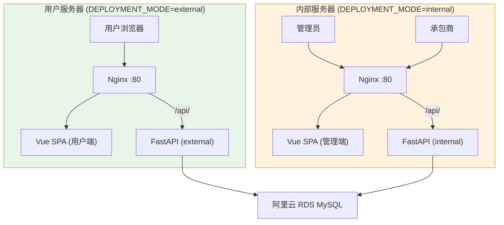
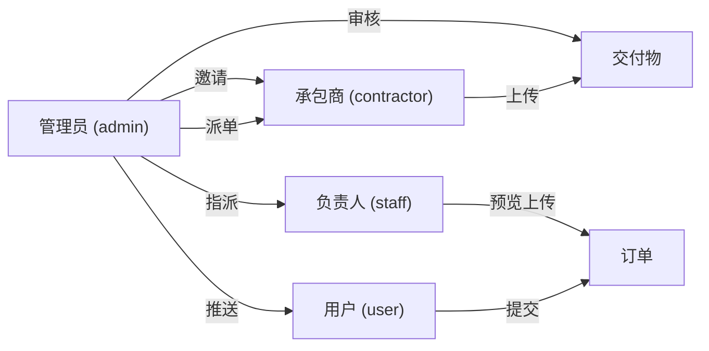
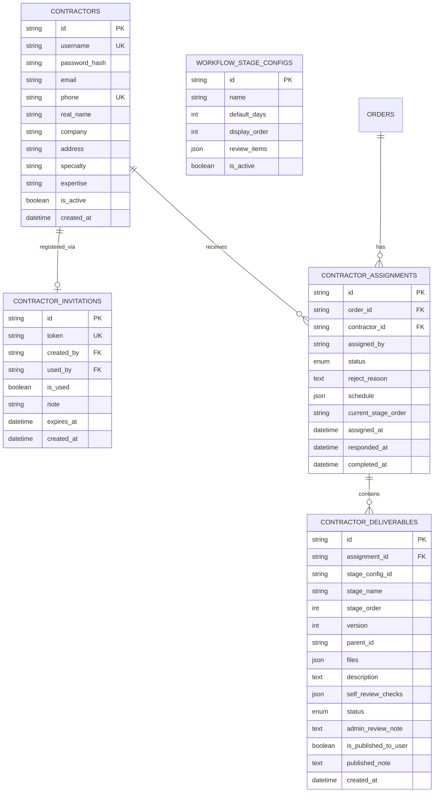
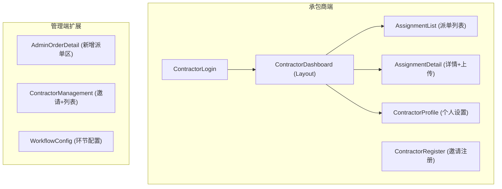
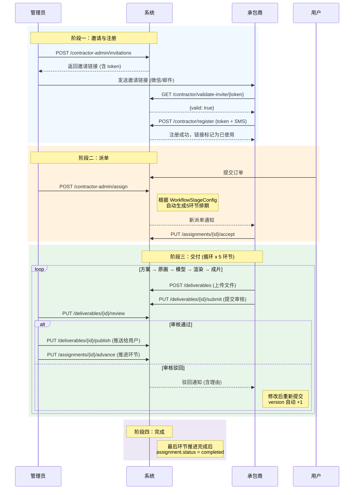
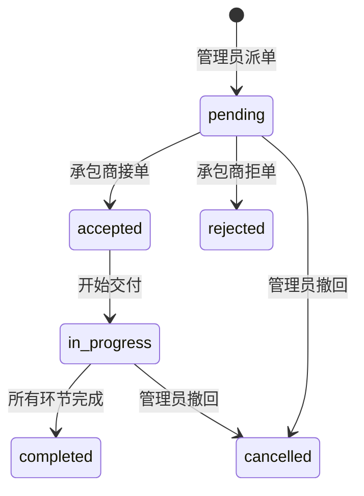
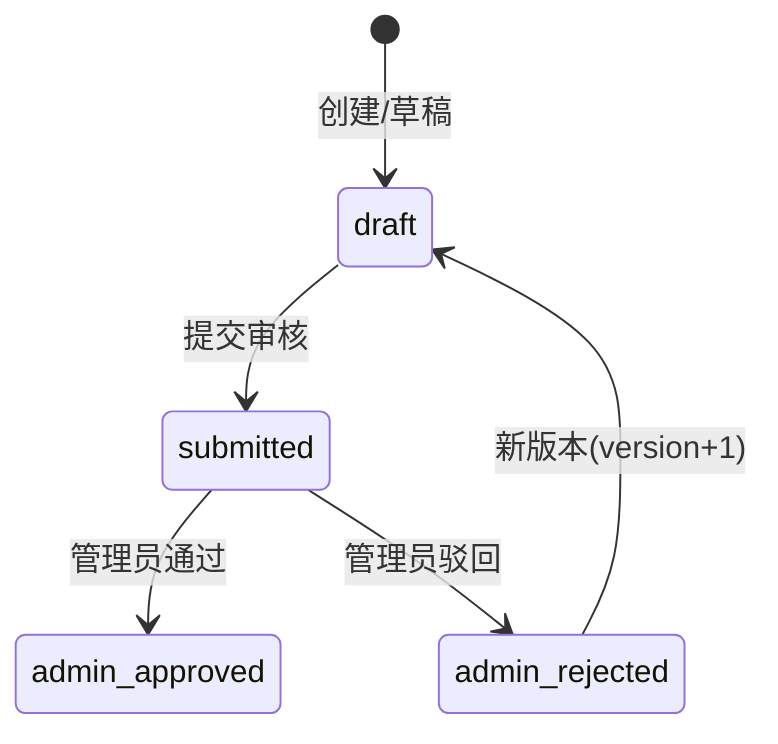

# 承包商角色系统 — 设计文档

> 版本: v1.0 · 最后更新: 2026-04-27

---

## 1. 系统概述

### 1.1 背景

在原有 `用户 → 管理员 → 负责人(设计师)` 的工作流之上，新增 **承包商 (Contractor)** 角色，用于将订单的内容制作环节外包给外部合作方。承包商通过邀请链接注册，按工作流环节分阶段交付内容，交付物经管理员审核后择选推送给客户。

### 1.2 设计目标

| 目标 | 说明 |
|------|------|
| **安全可控** | 邀请制准入、一次性链接、角色严格隔离 |
| **过程可追溯** | 每个环节的交付物有版本链，审核有记录 |
| **灵活可配置** | 工作流环节的名称、天数、审核项均可由管理员自定义 |
| **用户无感知** | 用户仅能看到管理员审核后推送的最终内容 |
| **部署可分离** | 支持内/外系统独立部署到不同服务器 |

---

## 2. 系统架构

### 2.1 整体架构图

> [!TIP]
> 开发阶段使用 `DEPLOYMENT_MODE=all`，所有路由在同一实例加载。生产环境拆分为 `external` + `internal` 两个实例。

### 2.2 角色矩阵

### 2.3 路由按部署模式加载

| 路由模块 | `external` | `internal` | `all` |
|----------|:----------:|:----------:|:-----:|
| `auth` (认证) | ✅ | ✅ | ✅ |
| `orders` (订单) | ✅ | ✅ | ✅ |
| `notifications` | ✅ | ✅ | ✅ |
| `upload` (文件上传) | ✅ | ✅ | ✅ |
| `ai` (AI 聊天/语音) | ✅ | ❌ | ✅ |
| `staff` (负责人管理) | ❌ | ✅ | ✅ |
| `contractor` (承包商端) | ❌ | ✅ | ✅ |
| `contractor-admin` (管理端) | ❌ | ✅ | ✅ |
| `workflow-config` (配置) | ❌ | ✅ | ✅ |
| `logs` (审计日志) | ❌ | ✅ | ✅ |
| `announcements` (公告) | ❌ | ✅ | ✅ |
| `enterprise` (企业认证) | ❌ | ✅ | ✅ |

---

## 3. 数据库设计

### 3.1 ER 关系图

### 3.2 表说明

#### `contractors` — 承包商账户
与 `users`、`admin_users`、`staff` 表完全独立，拥有独立的密码哈希和认证逻辑。

| 字段 | 类型 | 说明 |
|------|------|------|
| `company` | VARCHAR(100) | 公司名称（选填）|
| `specialty` | VARCHAR(200) | 专业方向，如"3D建模、视频后期" |
| `expertise` | VARCHAR(200) | 擅长领域，如"裸眼3D广告、产品展示" |

#### `contractor_invitations` — 一次性邀请链接
- `token`: 128-bit 随机字符串，URL-safe
- `is_used`: 注册成功后置为 `true`，该链接永久失效
- `expires_at`: 默认 7 天过期（管理员可配 1-30 天）

#### `contractor_assignments` — 派单记录
- `schedule`: JSON 数组，派单时根据 `workflow_stage_configs` 自动生成各环节截止日
- `current_stage_order`: 当前活跃环节序号，由管理员手动推进

#### `contractor_deliverables` — 交付物
- `version`: 版本号（1, 2, 3...），被驳回后新版本 +1
- `parent_id`: 指向被驳回的上一版本 ID，形成版本链
- `self_review_checks`: 承包商自审核结果，如 `{"内容安全合规性": true, ...}`
- `is_published_to_user`: 管理员审核通过后是否已推送给用户

#### `workflow_stage_configs` — 工作流环节配置
管理员可完全自定义。默认种子数据：

| 序号 | 名称 | 默认天数 | 审核项 |
|:----:|------|:--------:|--------|
| 1 | 方案 | 2 | 内容安全合规性、风格调性一致、技术规格达标、无版权侵权风险 |
| 2 | 原画 | 3 | 同上 |
| 3 | 模型 | 4 | 同上 |
| 4 | 渲染 | 3 | 同上 |
| 5 | 成片 | 3 | 同上 |

---

## 4. API 设计

### 4.1 承包商端 API (`/api/contractor`)

| 方法 | 路径 | 说明 | 鉴权 |
|------|------|------|------|
| `GET` | `/validate-invite/{token}` | 验证邀请链接有效性 | 无 |
| `POST` | `/register` | 邀请注册 (token + SMS) | 无 |
| `GET` | `/assignments` | 获取我的派单列表 | Contractor |
| `GET` | `/assignments/{id}` | 获取派单详情 | Contractor |
| `PUT` | `/assignments/{id}/accept` | 接单 | Contractor |
| `PUT` | `/assignments/{id}/reject` | 拒单 (含理由) | Contractor |
| `POST` | `/deliverables` | 创建交付物 (草稿) | Contractor |
| `PUT` | `/deliverables/{id}` | 更新交付物 | Contractor |
| `PUT` | `/deliverables/{id}/submit` | 提交审核 | Contractor |
| `GET` | `/profile` | 获取个人信息 | Contractor |
| `PUT` | `/profile` | 修改个人信息 | Contractor |

### 4.2 管理端 API (`/api/contractor-admin`)

| 方法 | 路径 | 说明 | 鉴权 |
|------|------|------|------|
| `POST` | `/invitations` | 生成邀请链接 | Admin |
| `GET` | `/invitations` | 获取邀请列表 | Admin |
| `DELETE` | `/invitations/{id}` | 撤销邀请 | Admin |
| `GET` | `/list` | 获取承包商列表 | Admin |
| `PUT` | `/{id}` | 编辑承包商 (启用/禁用) | Admin |
| `POST` | `/assign` | 派单 (自动生成排期) | Admin |
| `GET` | `/assignments` | 获取所有派单记录 | Admin |
| `PUT` | `/deliverables/{id}/review` | 审核交付物 | Admin |
| `PUT` | `/deliverables/{id}/publish` | 推送给用户 | Admin |
| `PUT` | `/assignments/{id}/advance` | 推进到下一环节 | Admin |

### 4.3 工作流配置 API (`/api/workflow-config`)

| 方法 | 路径 | 说明 | 鉴权 |
|------|------|------|------|
| `GET` | `/` | 获取所有环节 | Admin |
| `POST` | `/` | 新增环节 | Admin |
| `PUT` | `/{id}` | 编辑环节 | Admin |
| `DELETE` | `/{id}` | 删除环节 | Admin |
| `POST` | `/reorder` | 调整排序 | Admin |

### 4.4 通用文件上传 (`/api/upload`)

| 方法 | 路径 | 限制 | 说明 |
|------|------|------|------|
| `POST` | `/file` | 50MB | 支持图片、视频、文档、3D文件、压缩包 |
| `POST` | `/site-photo` | 20MB | 现场实拍图上传 |

---

## 5. 前端设计

### 5.1 页面架构

### 5.2 交付物上传组件（核心交互）

> AssignmentDetail 中的交付物上传区域是整个系统最复杂的交互组件。

**交互流程：**
1. 承包商拖拽/选择文件上传（支持多文件，单文件 ≤ 50MB）
2. 填写本次交付说明
3. **逐项勾选自审核检查项**（每次勾选需弹窗确认）
4. 全部检查项通过后，"提交审核"按钮激活
5. 提交后状态变为 `submitted`，等待管理员审核

### 5.3 数据隔离策略

| 数据类型 | 用户可见 | 承包商可见 | 管理员可见 |
|----------|:--------:|:----------:|:----------:|
| 用户个人信息 (姓名/手机) | ✅ 自己 | ❌ | ✅ |
| 承包商个人信息 (公司/专长) | ❌ | ✅ 自己 | ✅ |
| 订单需求数据 | ✅ 完整 | ✅ 脱敏 | ✅ 完整 |
| 交付文件原件 | ❌ | ✅ 自己的 | ✅ |
| 审核后推送内容 | ✅ | ❌ | ✅ |
| 审核备注 | ❌ | ✅ 收到的 | ✅ |
| 其他承包商派单记录 | ❌ | ❌ | ✅ |

---

## 6. 核心业务流程

### 6.1 邀请 → 注册 → 派单 → 交付 → 审核 → 推送

### 6.2 状态机

#### 派单状态 (AssignmentStatus)

#### 交付物状态 (DeliverableStatus)

---

## 7. 安全设计

### 7.1 认证机制
- **JWT Token**: 所有角色共用同一个 JWT 签发逻辑，`payload.role` 区分角色
- **角色路由守卫**: 后端 `require_contractor`、`require_admin` 装饰器 + 前端 `vue-router` beforeEach 双重校验
- **邀请链接**: UUID v4 token，一次性使用，默认 7 天过期

### 7.2 数据安全
- 承包商不可访问用户个人信息
- 用户不可知道承包商的存在
- 交付物推送给用户前，管理员可修改/删除备注中的敏感信息
- 审计日志记录所有关键操作（独立数据库存储）

### 7.3 文件上传安全
- 白名单文件类型过滤
- 文件大小限制（50MB）
- 文件名添加时间戳前缀防覆盖
- 路径按用户 ID 隔离

---

## 8. 扩展预留

| 功能 | 状态 | 说明 |
|------|------|------|
| 阿里云 OSS | 预留接口 | `OSS_ENABLED=true` 启用，当前默认本地存储 |
| 邮件通知 | 已集成 SMTP | 承包商派单/审核结果可触发邮件 |
| 短信通知 | 待扩展 | 当前仅用于登录验证码 |
| 系统内通知 | 已有基础设施 | `notifications` API 已就绪 |
| 多承包商竞标 | 架构支持 | 一个订单允许多条 assignment，当前仅派单到一人 |
